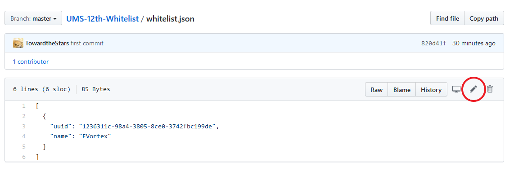
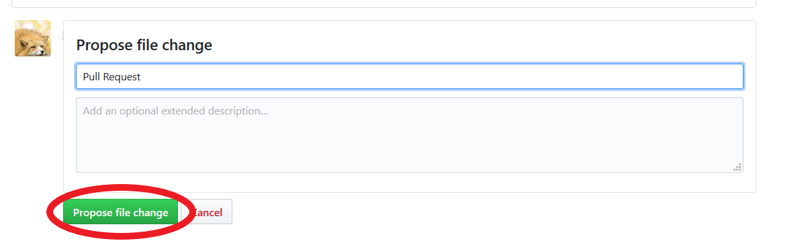

# UMS-12th-Whitelist

USTC Minecraft 12 周目白名单

## 申请白名单

提交 Pull request, 将自己的游戏 ID 和 UUID 加入 whitelist.json.


点击文件列表里面的 whitelist.json, 进入页面之后, 在右上角有一个笔的按钮 (如下图中红圈所示), 点击进去就可以编辑了.


格式:

```json
  ,
  {
    "uuid": 填入你的 UUID, 用双引号包起来
    "name": 填入你的游戏 ID, 用双引号包起来
  }
```
将上面这一段复制到到 whitelist.json 里面最后一个右中括号前, 并按要求填完. 并点击下图中的按钮, 提交 Pull request.


当然, 也可以直接把 UUID 和游戏 ID 发给管理员, 让管理员添加白名单.

### UUID 的获取

1. 请使用你想使用的游戏 ID 打开游戏, 并新建一个单机存档 (如果已有单机存档, 跳过此步).
2. 打开 游戏文件夹里的 saves/<你新建的或已有的单机存档>/playerdata 文件夹.
3. 里面应该只有一个 .dat 文件, 该文件的文件名 (不带后缀名) 即为你的 UUID.
